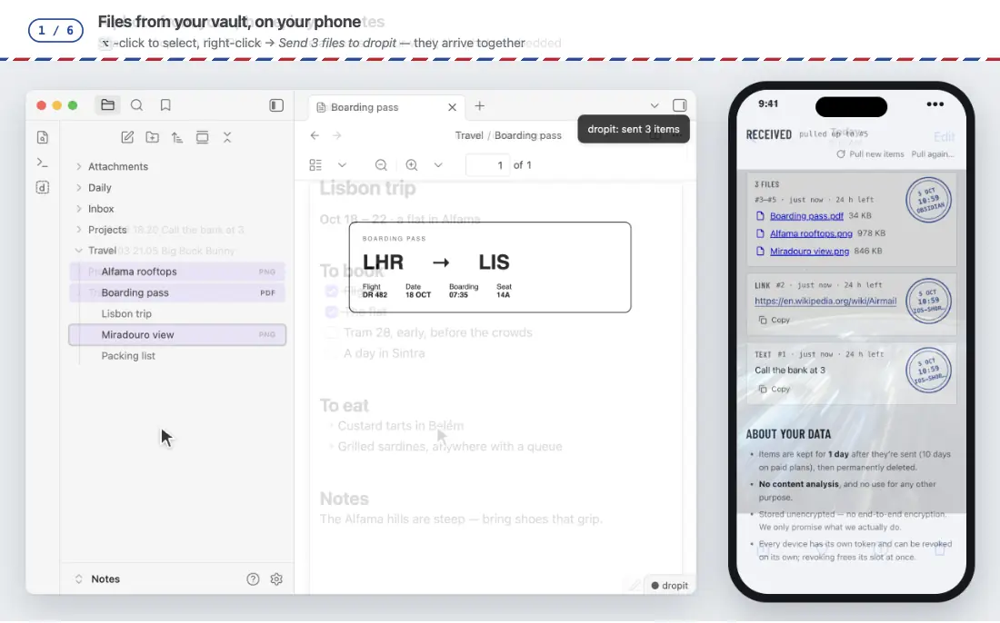

# dropit for Obsidian

**English** · [简体中文](./README.zh-CN.md)

**What you send from your phone, your browser or your terminal lands in your vault as notes —
titled, images embedded, sources linked. And anything in your vault goes out with a right-click.**

Desktop and mobile. Part of [dropit](https://github.com/smart-kits/dropit-client), a private pipe between your own devices.



<sub>Shown: Lonely Planet pages · a NASA photograph (public domain).</sub>

## What it's like

| Somewhere else, you… | In your vault, a few seconds later |
|---|---|
| Share a photo from your iPhone | A note named `10-04 15.30 IMG_2041`, the photo embedded, saved where your attachments go |
| Send a web page from Chrome | `[The article's title](link)` with the author's summary as a quote — not a bare URL |
| Select a paragraph in the browser and send it | The paragraph, and under it `— [Page title](link)`, so you always know where it came from |
| Send some text and three screenshots at once | **One** note: the text on top, the three images below |
| Type `dropit send "call the bank"` in a terminal | A note that says *call the bank* |
| Close the laptop for a weekend | Everything sent meanwhile, the moment you open Obsidian again — nothing missing, nothing twice |

And the other way: right-click a note, a PDF or a few images in the file list → *Send to dropit*,
and they're on your phone.

## Where things land

Pick once in *Settings → dropit → Write items to*:

| Choice | What you get |
|---|---|
| **A new note for each** (default) | One note per delivery in a folder you choose (`Inbox`), named by time and what it's about |
| **The end of one note** | Everything appended to a single note (`Inbox/dropit.md`), each under a time line |
| **Today's daily note** | Appended to today's daily note — your folder, date format and template from the *Daily notes* plugin; Templater templates are handed to Templater |

Files — images, videos, PDFs — are saved where Obsidian puts attachments (*Settings → Files and links*)
and embedded with your own link style, wikilinks or Markdown.

### A new note for each

```markdown
---
kind: url
source: chrome-extension
created: 2026-10-04T07:30:00.000Z
dropit_seq: 42
---

[How Airmail Worked](https://example.com/airmail)

> A short history of the red-and-blue envelope.
```

The file name is the time plus what it's about: `10-04 15.30 How Airmail Worked`. A link without a title
becomes `example.com/airmail`; text becomes its first line; a file its own name.
Things sent together share one note — text on top, files embedded below.

### The end of one note, or today's daily note

```markdown
**10-04 15:30** · ios-shortcut
![[IMG_2041.jpeg]]

**10-04 15:42** · chrome-extension
A paragraph worth keeping.

— [Page title](https://example.com/page)
```

Note: the daily note is the one for the day the item is **written**. Items caught up after a few days
offline go into today's note, not the day they were sent.

## Sending from your vault

| Where | What goes out |
|---|---|
| Select text in a note → right-click → *Send to dropit* | The selected text (a lone link is sent as a link) |
| Right-click a file in the file list → *Send to dropit* | A note goes as its Markdown text; any other file as the file itself |
| Select several files → right-click → *Send N files to dropit* | Up to 10 files, arriving together as one delivery |
| Command palette: *dropit: Send current note* · *dropit: Send selection* | The same, from the keyboard — bind them to hotkeys under *Settings → Hotkeys* |

A note goes as its text, front matter included; images embedded in it aren't sent along — select them
in the file list too. What you send from this vault is never written back into it.

## The status bar

One glance tells you the state; click it to sync now.

| Shows | Means |
|---|---|
| `● dropit` | Receiving in real time (hover for the days left of a trial) |
| `◌ dropit` | Connecting |
| `↻ dropit` | Syncing |
| `○ dropit` | No real-time on your plan right now: syncs when Obsidian opens or you come back to it |
| `○ dropit · offline` | Disconnected — reconnecting by itself |
| `⚠ dropit` | Something failed — hover for why; it tries again by itself (after about 5 s, 15 s, then every minute — later if the server asks for that). If this vault was removed from your account, it stops trying until you pair again or click to sync |
| `dropit · not paired` | Click to set it up |

When items arrive, one notice says how many — click it to open the last one.

## Nothing missed, nothing twice

- **Coming back catches up.** Open Obsidian, or switch back to it, and whatever arrived meanwhile is written.
- **A flaky network is ridden out.** A connection dropped on the way (a proxy, patchy Wi-Fi) is tried again
  before it counts; a failed sync retries on its own.
- **A file that won't download doesn't block the rest.** A line takes its place:
  `⚠️ report.pdf (820 KB) couldn't be downloaded: … Settings → dropit → Pull again tries once more.`
- **Pull again** (*Settings → dropit*): everything, the last N items, or the last N days. What's already in
  the vault is skipped, failed downloads are fetched again. With *A new note for each*, a note you deleted
  comes back; in the other two modes, what you deleted stays deleted.
- A newly joined device starts with what's sent after it joined; *Pull again* fetches what came before,
  for as long as your plan keeps items.

## Run your own command after each item

*Settings → dropit → Run a command after receiving* picks any Obsidian command — a QuickAdd macro, a
Templater script, another plugin's action. It runs once for each item, **after** the item is in the vault.

- **Delivery never depends on it.** The item is written first; the command runs afterwards, once, with no retry.
- **One item at a time**, a second apart.
- **dropit defines the format; your script is yours.** The plugin does nothing with the content beyond writing it.

Your script reads the current item from `app.plugins.plugins.dropit.received`:

```js
{
  v: 1,                      // format version
  seq: 42,                   // the item's number, increasing
  kind: 'image',             // 'text' · 'url' · 'image' · 'video' · 'file' · …
  source: 'web',             // where it was sent from
  created: '2026-09-29T07:30:00.000Z',
  batch: { id: 'b3k9x0', index: 2, count: 3 },   // null when sent on its own
  text: '',                  // the text or link; '' for files
  meta: { filename: 'budget.png', mime: 'image/png' },   // also title / description for links;
                             // from: { url, title? }, the page it was sent from (browser extension)
  note: 'Inbox/09-29 15.30 Slides for the 3pm meeting.md',   // where it was written
  files: ['Inbox/budget.png'],                   // files saved to the vault for it
}
```

`app.plugins.plugins.dropit.recent` holds the last 20. From another plugin or a startup script you can also
listen directly — every item, no command needed:

```js
app.workspace.on('dropit:received', (item) => { /* same object */ });
```

For example, a QuickAdd macro's user script:

```js
module.exports = async ({ app }) => {
  const item = app.plugins.plugins.dropit.received;
  if (item.kind !== 'url') return;
  // …your own processing
};
```

> **Treat the content as untrusted input.** Anyone holding a send-only token for your account — an
> old phone, a leaked shortcut — can put anything into it. Don't `eval` it, and never build a shell
> command line out of it: pass it to a program on **stdin** or in a file. The object is frozen, so a
> script can't change what the next one sees.

## Account, plan and network

- **A dropit account is required.** Creating one is free, in the plugin (*First time using dropit? → Create a new account*)
  or at [dropit.smart-kits.xyz](https://dropit.smart-kits.xyz). It asks for no name, email or phone number.
- **Some limits depend on your plan.** Everything described here works on the free plan, within its limits:
  30 items a day, files up to 5 MB, items kept for 1 day, 3 devices, and real-time delivery for the first 10 days
  after signing up. After that, new items come in when Obsidian opens, when you come back to its window, or when you
  click *Sync now*. The paid plan raises the limits and keeps real-time delivery on.
- **Network use.** The plugin talks to one service, the dropit server, over HTTPS and a WebSocket, to send and
  receive your items. No telemetry, no ads. Details in [Privacy](#privacy).
- **Files.** It reads and writes only inside this vault. It doesn't scan your notes: only when an item comes back a
  second time (*Pull again*, or a sync that was cut short), it looks up the `dropit_seq` (and other `dropit_…`) fields in each
  note's front matter through Obsidian's metadata cache, so the item isn't written twice. It never reads note bodies for this.
- **Clipboard.** *Add a device → Generate a pairing code* writes the code to the clipboard so you can paste it.
  The plugin never reads the clipboard.

## Set up

1. **Install.** *Settings → Community plugins → Browse*, search **dropit**, *Install*. Or download it from
   [dropit.smart-kits.xyz](https://dropit.smart-kits.xyz) and unzip it into `<your vault>/.obsidian/plugins/`,
   or clone it there:

   ```bash
   git clone https://github.com/smart-kits/dropit-obsidian.git "<your vault>/.obsidian/plugins/dropit"
   ```

   Then *Settings → Community plugins* → enable **dropit**.
2. **Join.** *Settings → dropit* opens on *Join with a pairing code*. On a device you already use, show a
   code (web inbox: *Devices*; terminal: `dropit code`), type its 6 characters, press *Join*.
   Your first device ever? *First time using dropit? → Create a new account*.
3. **Add your other devices from here.** *Settings → dropit → Add a device → Generate a pairing code*:
   type the code on the new device, or scan the QR code with its camera. The code is copied for you,
   and the page notices when the device has joined.

Using an AI coding agent (Claude Code, Codex, Cursor…)? Paste this and it installs the plugin for you:

```text
Install the dropit plugin into my Obsidian vault by following
https://raw.githubusercontent.com/smart-kits/dropit-obsidian/main/AGENTS.md
Ask me which vault and before creating an account, and never show or commit my token.
```

## Settings

| Setting | What it does |
|---|---|
| *(top line)* | The connection state and your account: plan · devices · space · how long items are kept. *Sync now* next to it |
| Write items to · Folder · Note | Where items land (above) |
| Run a command after receiving | Your command, or none |
| Pull again | Everything · the last N items · the last N days |
| Add a device | A pairing code and its QR code |
| Devices | Every device on your account; *Remove* stops one right away |
| Feedback | *Report a problem* (a new public issue with your versions filled in) · *Source code* |
| Advanced → Server address | Only if you were given another address; the built-in one is always tried last |
| Advanced → Unpair | Removes this vault from your account (freeing its device slot) and forgets its sign-in; your settings stay |

The interface follows Obsidian's language: English, or Simplified Chinese when Obsidian is set to Chinese.

## When something goes wrong

| You see | It means | Do this |
|---|---|---|
| `⚠ dropit` · *Can't reach the server* | The network or a proxy is dropping connections | Usually nothing — it retries. If it stays, check the proxy, or let it connect to dropit directly |
| *Invalid token* · *This device was removed* | This vault was removed from your account | Join again with a new code |
| *Device limit reached* | Your plan's device count is used up | Remove a device you no longer use (*Settings → dropit → Devices*) |
| *Pairing code expired* | Codes last 5 minutes and work once | Generate a new one |
| *Real-time trial ended* | New accounts get real-time for a while; after that it syncs when you open or come back to Obsidian | Nothing to fix — click the status bar to sync any time |
| `⚠️ … couldn't be downloaded` in a note | The file didn't come down this time | *Settings → dropit → Pull again* |

Anything else: *Settings → dropit → Feedback → Report a problem* (a public issue). For questions about your account you'd rather not post publicly, email [support@dropit.smart-kits.xyz](mailto:support@dropit.smart-kits.xyz).

## Privacy

- The sign-in is stored in this plugin's `data.json` inside your vault. **If you sync or publish your vault,
  exclude `.obsidian/plugins/dropit/data.json`.** *Unpair* clears it.
  A synced vault that takes `data.json` along (Obsidian Sync with community plugin settings, iCloud, Syncthing, Git)
  also makes every copy receive as the same device, so an item can be written once by each copy. Let one copy receive:
  keep `data.json` out of the sync.
- Text from other devices and web pages is never run as code. If Templater is set to run new notes as templates
  (*Trigger Templater on new file creation*), `<%` in what arrives is written with an invisible zero-width space after
  the `<`, so Templater doesn't see a command in it. It looks the same; the payload your command gets keeps the original.
- Each device has its own key and can be removed on its own; removing one frees its slot at once.
- Pairing this vault again (for example after reinstalling the plugin) takes the earlier pairing's place instead of
  using another slot. To recognize it, the plugin sends the key it had, if any, and a SHA-256 hash of a random ID.
  The ID is made the first time this vault joins dropit and kept in Obsidian's local storage for this vault on this device — not in
  `data.json`, and not synced with the vault — so it outlasts a reinstall. Nothing about your computer or phone goes
  into it, only the hash leaves the device, and it is not a credential.
- The plugin talks to one service, the dropit server, to send and receive your items. What it keeps, for how long and
  who can see it: [Privacy](https://dropit.smart-kits.xyz/privacy).

## Development

```bash
ln -s "$(pwd)" "<your vault>/.obsidian/plugins/dropit"   # edit here, reload in Obsidian
node test.cjs                                             # no dependencies
brew install gitleaks && git config core.hooksPath .githooks   # block tokens from being committed
```

Commit messages are in English. Docs come in pairs — please update both `README.md` and `README.zh-CN.md`.

## License

[MIT](./LICENSE)
